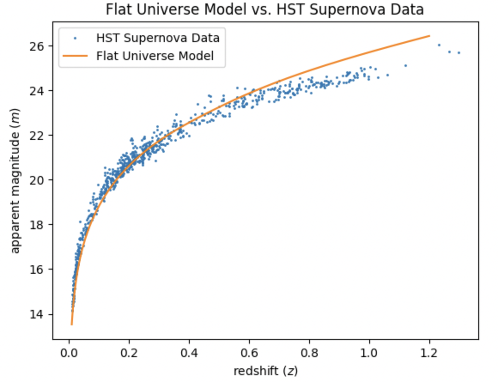
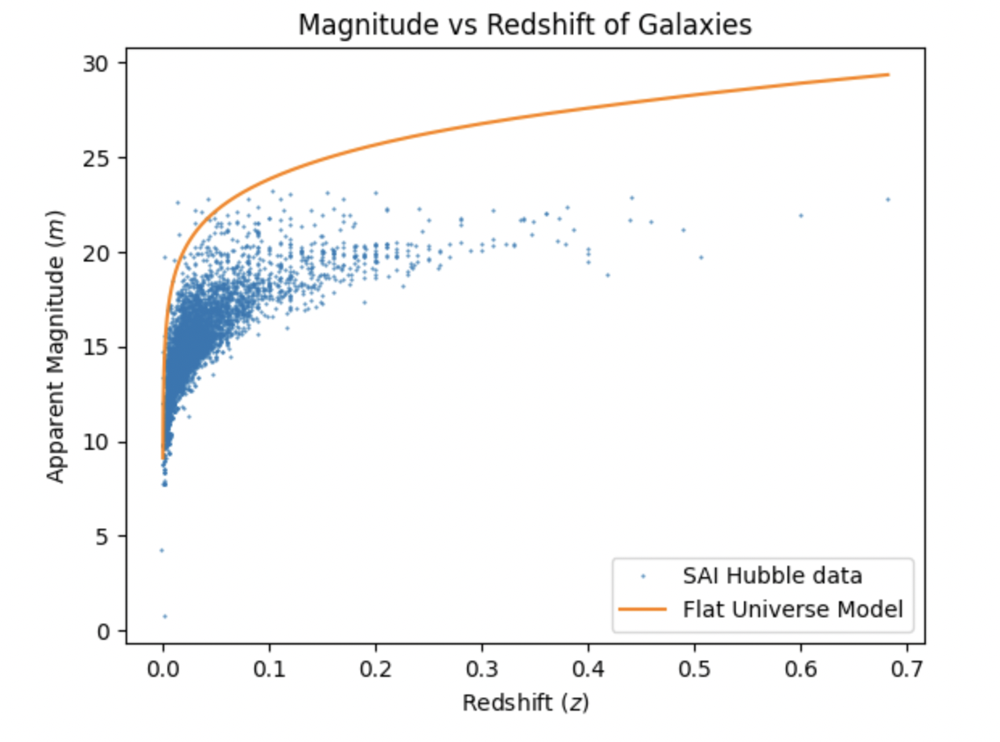

# Astro C161 Final Project: Evaluating the Flat Universe Model with Type 1a Supernovae and Galaxies
## By Caitlin Begbie and Emma Yu
### Introduction
In this project our objective was to determine the feasibility of assuming we live in a flat universe. We did this by considering Type IA supernovae data and galaxy data from the Hubble Space Telescope (HST) with their associated Hubble parameters. To do this, we first determined a relation between redshift ($z$) and apparent magnitude ($m$) for a flat universe model, which we then used to generate curves for both of our respective data sets. By comparing the curves to our observation data, both visually and using reduced chi-squared analyses, we found that the flat universe model reasonably fits our data.

### Background
#### *Sourcing Our Data*
We wanted to consider two different populations for this project because if our universe is flat, the redshift vs. apparent magnitude relation should hold for all light-emitting sources, not just one. By proving the relation holds true for two different sources, we can more accurately make the claim that the flat universe model applies, well, universally. To begin, we wanted to explore the population of Type 1A Supernovae because their absolute magnitudes are relatively the same, at about $M = -19.5$. Knowing this, we could easily apply the magnitude relation in our curve consideration. We sourced our Type 1A Supernova data from a Wolfram Alpha educational notebook which got its data from the following paper: [Type Ia Supernova Distances at Redshift >1.5 from the Hubble Space Telescope Multicycle Treasury Programs: The Early Expansion Rate](https://iopscience.iop.org/article/10.3847/1538-4357/aaa5a9/pdf). Not only was this data publicly available, but it was also filtered for easy analysis.

Along with Type 1A Supernova, we wanted to consider how the redshift - apparent magnitude relation appeared in galaxies, as these do not have a consistent absolute magnitude across the entire population. We sourced our galaxy data from the publicly available [Sternberg Astronomical Institute (SAI) Supernova Catalog](http://stella.sai.msu.su/sncat/dbstructure.html). After converting the raw data to a more digestible CSV format, we were able to plot these data points as well, though it is worth noting that the data was decidedly less clean than the supernova data that we considered.

#### *Creating Our m-z Relation*
To create our relation between apparent magnitude ($m$) and redshift ($z$), we began by using the classic equation for apparent magnitude and applied both the luminosity distance equation and the Friedmann-Robertson-Walker Metric, evaluated for a flat universe, to create our final relation:

$\Huge m-M = 5log_{10}[\frac{{\frac{c}{H_{0}}}(1+z)\int_{0}^{z}\frac{1}{E(z')} \,dz'}{1 Mpc}]+25$ 

In this function, $E(z) = \frac{H(z)}{H_0}$, where $H(z)$ is the Hubble parameter and $H_0$ is the Hubble constant, or Hubble parameter evaluated at our current time. The complete derivation for this relation can be found in our notebook file.

We used this function to evaluate the curve fit for both populations, the only changes being in the consideration of the absolute magnitude values.

#### *Setting Up Our Virtual Environment*
Due to the amount of packages that we wanted to download for this project, along with the computational work we wanted to do, we decided to use a virtual environment in our coding efforts. We did this by using the venv package and creating a requirements.txt file to record all of our downloads and specifications for this environment. This was particularly helpful because it allowed us to use Jupyter Lab and other large packages without taking up excessive space on our personal hard drives.

### Analysis
Using our relationship derived above, we were able to create curves for each of the population data sets, and model them next to the original data. The graphs of each of these are shown here:

 

We then utilized a reduced chi-squared analysis for each of the populations, and yielded the following results:

$\tilde{\chi}^2_s =  1.723 \times{10^{-5}}$ and $\tilde{\chi}^2_g =  7.606 \times{10^{-4}}$ 

With low $\tilde{\chi}^2_s$ values like this, we can conclude that our fits are done pretty well, though it is worth noting that these values are so small because we have many degrees of freedom. Visually, the galaxy fit is not nearly as aligned as the supernova fit which is likely due to two different reasons: (1) Since the galaxies did not have a consistent absolute magnitude over the entire population, we calculated the average in order to produce a smooth curve and (2) We were unable to find interpolation data for a wide range of galaxies, meaning that we used the same interpolation criteria that we used for the supernovae. Because of these two liberties that we took in fitting the galaxies, we have an order of magnitude difference between the two fits implying, in this case, that the fit for the galaxies is not amazing. However, it can still be seen that the galaxies follow the trend predicted by the flat universe metric, so it can still be concluded that the model is relevant. 

### Results
In completing this project, we concluded that the Type 1a Supernovae data supports the flat universe model. In our efforts to create an apparent magnitude versus redshift relation indicative of a flat universe, and then applying it to two different populations, we were able to see that this model is reasonably accurate in considering luminous populations.

### About Our Repository
- [flat_universe_modeling.ipynb](https://github.com/caitlinbegbie/C161-final-project/blob/main/flat_universe_modeling.ipynb) : Final project notebook containing equation derivation, model creation for both populations, analysis, and commentary.
- [galaxy_plottingdata.csv](https://github.com/caitlinbegbie/C161-final-project/blob/main/galaxy_plottingdata.csv) : Cleaned and formatted SAI Supernova Catalog data.
- [requirements.txt](https://github.com/caitlinbegbie/C161-final-project/blob/main/requirements.txt) : Requirements file for our project virtual environment.
- [sn_plottingdata_cleaned.csv](https://github.com/caitlinbegbie/C161-final-project/blob/main/sn_plottingdata_cleaned.csv) : Type 1A Supernova data from M. Bradley, 2022.
- [sncat_latest_view.txt](https://github.com/caitlinbegbie/C161-final-project/blob/main/sncat_latest_view.txt) : Raw data downloaded from SAI Supernova Catalog.

### References
- [A. Riess, S. Rodney, D. Scolnic, et al. 2018. "Type Ia Supernova Distances at Redshift >1.5 from the Hubble Space Telescope Multicycle Treasury Programs: The Early Expansion Rate".](https://iopscience.iop.org/article/10.3847/1538-4357/aaa5a9/pdf)
- [M. Bradley. 2022. "Type Ia Supernova Data".](https://datarepository.wolframcloud.com/resources/Type-Ia-Supernova-Data/)
- [SAI Supernova Catalog](http://stella.sai.msu.su/sncat/dbstructure.html)
